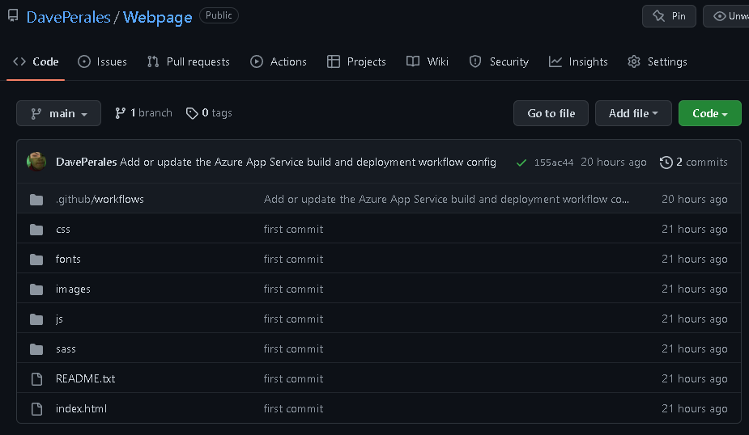
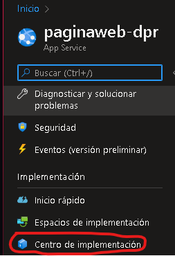
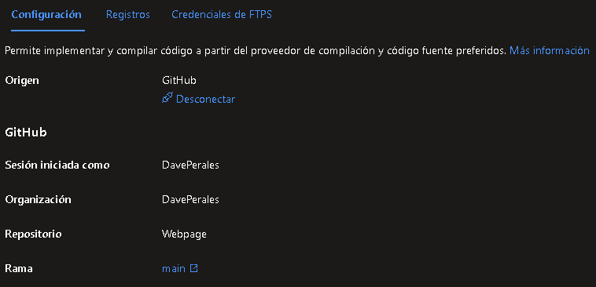

# Práctica 3

## Tabla de contenidos
- [Práctica 3](#práctica-3)
  - [Tabla de contenidos](#tabla-de-contenidos)
  - [Objetivo](#objetivo)
  - [Procedimiento](#procedimiento)

---
## Objetivo
Crear una página web a través de Azure App Service.

---
## Procedimiento

1. Acceder al [portal de Azure](portal.azure.com) y buscar _"App Services"_.
2. Creamos un App Service al presionar el botón **Crear**.
3. En el campo **Nombre de máquina virtual** escribimos _Sesion4_ y automáticamente se creará el grupo de recursos.

4. En el campo **Suscripción** elegimos _Azure for students_.

5. En el campo **Detalles de la instancia** escribimos el nombre de la instancia que será _paginaweb-dpr_ y en _Pila del entorno en tiempo de ejecución_ elegimos **PHP 8.0**.

6. En el campo **Región** elegimos _Central US_.

7. En el campo **SKU y tamaño** elegimos la opción _Gratis F1 1 GB de memoria_.

8. Finalmente damos click en **Revisar y crear** y esperamos a que se complete la implementación.

9.  Es necesario crear un nuevo repositorio que contenga el código de nuestra página web, una vez esté subido a Github nos dirigimos a la aplicación web creada. 

10. Nos dirigimos a la aplicación web creada y nos dirigimos a **Centros de implementación**

11. Iniciamos sesión en GitHub y seleccionamos el repositorio y la rama que contiene el código que queremos cargar en nuestra página y damos click en **Guardar**.

12.  Accedemos al enlace de nuestra [página web](https://paginaweb-dpr.azurewebsites.net). 

